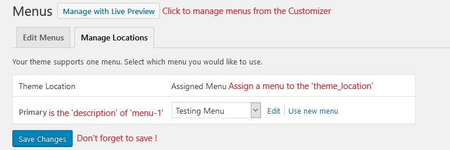

# bsWalker.js
A lightweight jQuery Walker to implement Bootstrap 4.0+ multilevel dropdown navigation in WordPress.

## Installation

Place **bsWalker.min.js** in a **js** folder in your WordPress theme folder `/wp-content/your-theme/js`

Open your WordPress themes **functions.php** file - `/wp-content/your-theme/functions.php` - and add the following code:

```php
/**
 * Enqueue bsWalker.
 */
function enqueue_bswalker() {
    wp_enqueue_script( 'bswalker', get_theme_file_uri( '/js/bsWalker.min.js' ), array( 'jquery' ), filemtime( get_theme_file_path( '/js/bsWalker.min.js' ) ), true );
}
add_action( 'wp_enqueue_scripts', 'enqueue_bswalker' );
```

## Usage

The `wp_nav_menu()` function is usually found in the **header.php** file of your theme - `/wp-content/your-theme/header.php`.

It looks like the following code :

```php
wp_nav_menu(
    array(
        'argument' => 'value',
        'argument' => 'value',
        'argument' => 'value',
        // And so on.
    )
);
```

An example of a Fixed top Responsive Navbar that automatically collapses at the lg (large) breakpoint  
**SHOULD mostly** look like this :

```html
<nav id="mainNav" class="navbar navbar-expand-lg navbar-light fixed-top" role="navigation">
    <div class="container">
        <a class="navbar-brand" href="<?php echo esc_url( home_url( '/' ) ); ?>" rel="home"><?php bloginfo( 'name' ); ?></a>
        <button class="navbar-toggler navbar-toggler-right" type="button" data-toggle="collapse" data-target="#navbarResponsive" aria-controls="navbarResponsive" aria-expanded="false" aria-label="Toggle navigation">
            <?php esc_html_e( 'Menu', 'your-theme-text-domain' ); ?>
            <span class="navbar-toggler-icon"></span>
        </button>
        <?php
        wp_nav_menu(
            array(
                'container'       => 'div',
                'container_class' => 'collapse navbar-collapse',
                'container_id'    => 'navbarResponsive',
                'menu_class'      => 'navbar-nav ml-auto', // See third note bellow (Spacing).
                'theme_location'  => 'menu-1', // See first note bellow.
            )
        );
        ?>
    </div>
</nav><!-- #mainNav -->
```

### Notes

1- Don't forget to replace the `'theme_location'` in the above code by the one of your theme.  
You can find the `'theme_location'` of your theme in the **functions.php** file - `/wp-content/your-theme/functions.php`.  
The code will look like this :
```php
register_nav_menus(
    array(
        'menu-1' => esc_html__( 'Primary', 'your-theme-text-domain' ),
        // The 'theme_location' here is 'menu-1'.
        // 'Primary' is the 'description' that you'll see in the backend.
    )
);
```
2- The main navigation `id` is `mainNav`.  
If you change the main navigation`id` for design purposes, you will also have to change it in **bsWalker.min.js** !

3- Follow this link to learn more about the [Bootstrap Navbar](https://getbootstrap.com/docs/4.3/components/navbar/) and this one for [Spacing](https://getbootstrap.com/docs/4.3/utilities/spacing/).

## Displaying the menu

To display the menu, you'll have to assign a menu in your backend ( or with the Customizer ),  
to the 'description' of the menu 'theme_location' (see the first note above and the image bellow).  
Go to *Dashboard* > *Appearance* > *Menus* > *Manage Locations (tab)*  


## Customizer Editing Menu 

### Important if you want to manage menus from the Customizer !

When you edit a menu from the Customizer by changing items order or adding/removing items,  
a partial refresh is made within the Customizer preview on the menu container,  
then the menu is displayed according to your modifications.

Since a partial refresh is made on the menu container, it's structure will change,  
and **bsWalker** should also be reloaded to apply **Navbar** styles on the new structure,  
otherwise, the menu will loose Navbar styles and it will not have the same look as on frontend.

To take care of this issue, **bsWalker** should be fully reloaded **after** the partial refresh is done.  
To accomplish this task, another lightweight js file is needed.  
In the **functions.php** file of you theme - `/wp-content/your-theme/functions.php` - add the following code:
```php
function bswalker_customize_preview_js() {
	wp_enqueue_script( 'bswalker-customizer', get_theme_file_uri( '/js/bsWalker-customizer.min.js' ), array( 'jquery', 'customize-preview' ), filemtime( get_theme_file_path( '/js/bsWalker-customizer.min.js' ) ), true );
}
add_action( 'customize_preview_init', 'bswalker_customize_preview_js' );
```
Put **bsWalker-customizer.min.js** file in the same **js** folder as **bsWalker.min.js**

### Very Important !

You absolutely have to change `"menu-1"` in **bsWalker-customizer.min.js**  
to your `'theme_location'` string (e.g. "primary").

## Changelog

### v1.0 - September 12 2019

* Added bsWalker.js
* Added bsWalker-customizer.js
* Added screenshot
* Updated Readme.md
* **bsWalker.min.js** 1.22KiB = 1.24928 KB  
* **bsWalker-customizer.min.js** 1.48 KiB =1.51552 KB
